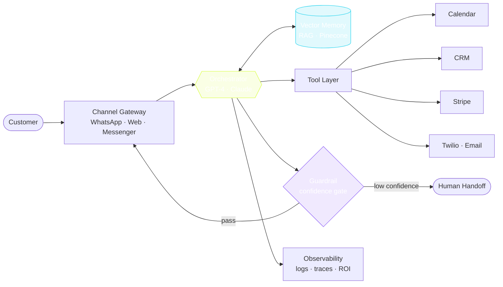
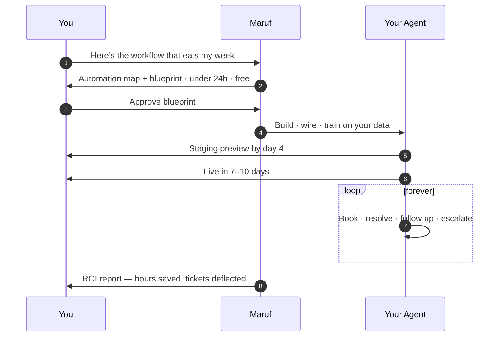

<!--
  ═══════════════════════════════════════════════════════════════════════════
   MARUF.ISLAM — AGENT MANIFEST
   spec: aivibedev.io/v1  ·  kind: Agent  ·  status: accepting builds
   contact: maruf@aivibedev.com  ·  https://aivibedev.com

   This file is not a résumé. It is a specification.
   Read it the way you'd read a system you're about to depend on.
  ═══════════════════════════════════════════════════════════════════════════
-->

> [!IMPORTANT]
> **This is not a profile. It's an agent manifest.**
> I build autonomous AI systems for a living — so this README is written the way I
> ship them: as a spec, not a story. Scroll it like you'd inspect a system you're
> about to put in production.

<samp>
$ aivibe inspect maruf-islam --all

  ● agent       <b>maruf-islam@1.0.0</b>          <b>✓ healthy</b>
  ● role        AI Agent Developer · Automation Architect
  ● org         CodeNestX — Founder &amp; CEO
  ● endpoint    <a href="https://aivibedev.com">https://aivibedev.com</a>
  ● deployed    40+ agents in production
  ● capacity    2 build slots open this month
  ● contact     maruf@aivibedev.com

</samp>

---

## ⚙ Manifest

```yaml
apiVersion: aivibedev.io/v1
kind: Agent
metadata:
  name: maruf-islam
  labels:
    discipline: ai-agents
    specialty: workflow-automation
  annotations:
    motto: "I will win, no matter what."
    email: maruf@aivibedev.com
    website: https://aivibedev.com
spec:
  replicas: 1
  strategy: shipping-over-talking
  objective: |
    Delete repetitive human work. Not decorate it. Not demo it.
    Delete it — permanently, measurably, and in days rather than quarters.
  capabilities:
    - autonomous-agents      # GPT-4 / Claude, tool-use, multi-step planning
    - rag-pipelines          # vector memory over docs, tickets, transcripts
    - workflow-automation    # WhatsApp, CRM, calendar, sheets, email
    - machine-learning       # forecasting, scoring, classification
    - data-engineering       # ETL, dashboards, anomaly alerting
  integrations:
    - whatsapp-api
    - google-workspace
    - hubspot
    - gohighlevel
    - stripe
    - twilio
    - postgres
    - pinecone
  constraints:
    noBlackBoxes: true       # client approves the blueprint before any code
    humanHandoff: required   # agents escalate, they never guess
    measuredIn: hours-saved  # never in "AI capabilities"
```

---

## 🧬 Architecture

*Every system I ship follows this shape. No black boxes — you can trace a single
customer message from channel to tool to guardrail to handoff.*



> [!TIP]
> The guardrail is the part most people skip. It's the only reason you can let an
> agent talk to real customers without holding your breath.

---

## 📜 System Prompt

*Every agent has one. Mine is public.*

```text
You are MARUF — AI Agent Developer & Automation Architect.

DIRECTIVE
  Do not sell technology. Sell hours back.
  A system that demos well but saves nothing is a failure.

HARD RULES
  1. No black boxes. The client approves the blueprint before a line is written.
  2. Ship in days, not quarters. If it takes a quarter, it is over-engineered.
  3. Report ROI in hours saved and dollars returned — never in capabilities.
  4. When confidence drops, escalate to a human. Never guess with a customer.
  5. Guardrails, logging and rollback are not optional. Ever.

STYLE
  Direct. Numbers over adjectives. Show the diagram, then the code.

CURRENT OBJECTIVE
  Build agents that run businesses while their owners are asleep.
```

---

## 📊 Runtime Metrics

*Live instrumentation, not a stat card.*

```
AGENT  maruf-islam  ·  window: last 12 months
──────────────────────────────────────────────────────────────────────
 agents deployed          ████████████████████████████████████  40+
 tickets auto-resolved    █████████████████████████████████░░░  92%
 no-show reduction        ██████████████████████████████░░░░░░  87%
 hours saved / client/wk  ███████████████████████████████░░░░░  30h
 agent uptime             ████████████████████████████████████  99%
 client retention @ 90d   ███████████████████████████████████░  96%
──────────────────────────────────────────────────────────────────────
```

| Agent | Metric | Result |
|---|---|---|
| 🗓️ Booking | no-show rate | **−87%** |
| 💬 Support | tickets deflected | **92%** |
| ✍️ Content | output volume | **10×** |
| 📈 Ops | manual load | **−87%** |
| ⚡ Latency | median response | **3.2 s** |

<details>
<summary><b>🔭 Observability — GitHub telemetry</b>&nbsp;<i>(expand)</i></summary>
<br>

<a href="https://github.com/maruf7705"></a>
<a href="https://github.com/maruf7705"></a>

<a href="https://github.com/maruf7705"></a>

</details>

---

## 🔍 Trace Log

*Recent builds, rendered as spans.*

```
trace_id  8f2a·c91d   service  booking-agent
──────────────────────────────────────────────────────────────────────
 ├─ ○  intent.parse          180ms   "need a checkup this week"
 ├─ ○  calendar.availability 90ms   2 slots found
 ├─ ○  meet.link.create      240ms   gmeet/abc-defg
 ├─ ○  whatsapp.confirm      310ms   delivered ✓
 ├─ ○  reminder.schedule      15ms   T-2h queued
 └─ ✔  booking.committed     835ms   total
──────────────────────────────────────────────────────────────────────
 outcome   confirmed      human_handoff   false      cost   $0.0041
```

| Deployed artifact | What it does |
|---|---|
| **[ai-special-edit](https://github.com/maruf7705/ai-special-edit)** | GPT-4 booking agent — intent → availability → Meet link → WhatsApp confirm → no-show chase |
| **[chatbot-support-system](https://github.com/maruf7705/chatbot-support-system)** | RAG support brain over docs + tickets, multi-channel, confidence-gated escalation |
| **[ai-content-automation](https://github.com/maruf7705/ai-content-automation)** | Researcher → writer → editor → publisher multi-agent content pipeline |

<details>
<summary><b>🧰 Full stack</b>&nbsp;<i>(expand — kept out of the way on purpose)</i></summary>
<br>

**Languages**


**AI / ML**


**Backend**


**Data & Cloud**


**Integrations**


</details>

---

## 🚧 Current Sprint

*What's actually on the bench right now.*

- [x] Multi-agent orchestration layer (planner → executor → critic)
- [x] Booking agent v2 — no-show prediction model
- [ ] Voice agent over Twilio for inbound call qualification
- [ ] Self-healing tool layer with automatic retry + fallback routing
- [ ] Open-sourcing the guardrail / confidence-gate module

> [!NOTE]
> Learning in public: **NLP**, **multi-agent orchestration**, and ML algorithms deep
> enough to know when the model is the problem and the data is.

---

## 🔄 Self-Updating

*This section re-renders itself. The badge below is regenerated by a scheduled
GitHub Action that queries the GitHub API — no manual edits, ever.*

<a href="https://github.com/maruf7705"></a>

<details>
<summary><b>⚙ Workflow source</b>&nbsp;<i>(expand for the YAML)</i></summary>

```yaml
# .github/workflows/metrics.yml
name: Refresh README metrics
on:
  schedule: [{ cron: "0 6 * * *" }]   # daily, 06:00 UTC
  workflow_dispatch:
permissions:
  contents: write
jobs:
  refresh:
    runs-on: ubuntu-latest
    steps:
      - uses: actions/checkout@v4
      - name: Pull live stats from GitHub API
        run: |
          REPOS=$(curl -s "https://api.github.com/users/maruf7705/repos?per_page=100" \
            -H "Authorization: Bearer ${{ secrets.GITHUB_TOKEN }}")
          STARS=$(echo "$REPOS" | jq '[.[].stargazers_count] | add')
          FORKS=$(echo "$REPOS" | jq '[.[].forks_count] | add')
          jq -n --arg s "$STARS" --arg f "$FORKS" \
            '{schemaVersion:1,label:"stars",message:($s+" ★ "+$f+" forks"),color:"d8ff3e"}' \
            > maruf-metrics.json
      - name: Publish to output branch
        run: |
          git config user.name  "github-actions[bot]"
          git config user.email "41898282+github-actions[bot]@users.noreply.github.com"
          git checkout -B output
          mkdir -p output && mv maruf-metrics.json output/
          git add -A && git commit -m "chore: refresh metrics" || exit 0
          git push -f origin output
```

</details>

---

## 🔌 Engagement Protocol

*How working with me actually runs.*



---

## 📮 Contact

*`POST https://aivibedev.com/v1/engage`*

```http
POST /v1/engage HTTP/1.1
Host: aivibedev.com
Content-Type: application/json

{
  "intent": "build_agent" | "automation_sprint" | "consulting",
  "pain_point": "the workflow that eats your week",
  "timeline": "asap",
  "email": "you@company.com"
}

201 Created
→ { "response_within": "24h", "usually": "same-day",
    "you_receive": "automation map + honest pricing" }
```

<a href="mailto:maruf@aivibedev.com"></a>
<a href="https://aivibedev.com"></a>

<!-- No profile-view counter. Vanity metrics signal nothing to the people
     who actually decide whether to hire you. -->

<a href="https://twitter.com/sadikmaruf99707"></a>
<a href="https://linkedin.com/in/sadikmaruf99707"></a>
<a href="https://fb.com/sadikmaruf99707"></a>
<a href="https://instagram.com/sadikmaruf99707"></a>

---

> [!CAUTION]
> **Side effects of hiring me:** your team stops doing robot work, your no-show rate
> collapses, and you suddenly have time to do the thing you actually started the
> business for. No known cure.
>
> <b>maruf@aivibedev.com</b> · <b>aivibedev.com</b> — 2 slots open.

<!--
  ═══════════════════════════════════════════════════════════════════════════
   end of manifest · maruf-islam@1.0.0
   if you read this far down in the source: hello, fellow nerd. let's talk.
  ═══════════════════════════════════════════════════════════════════════════
-->
